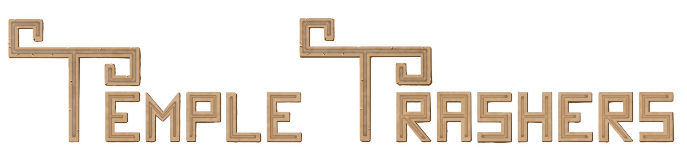
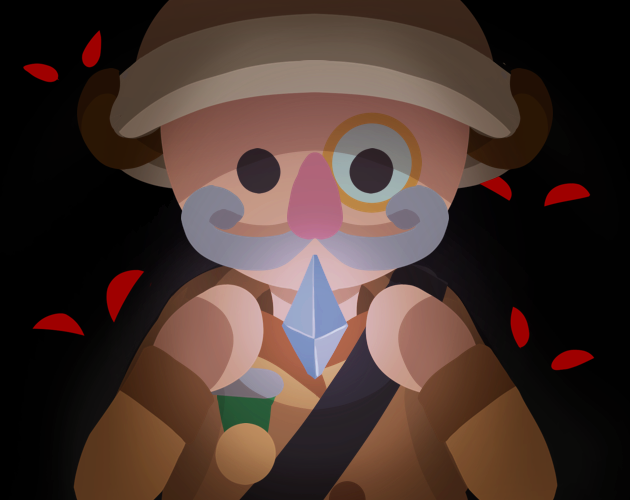

 

"Temple Trashers" is a couch co-op tower defense game, in which the towers you build can hurt you and your friends just as much
as they can hurt your enemies.
Build towers, aim them towards your foes and collect the crystals that drop in order to build more turrets and survive the
endless hordes of enemies!

The game was developed by the "Prosjekt: Spill" group of the Hackerspace NTNU student organization over the span of 2 years.
The project is open-source and free for all who are interested.
For other projects and information, take a look at [Hackerspace's website](https://www.hackerspace-ntnu.no/).

In 2022, Temple Trashers was nominated for the "Most Innovative Game Design" award at the [Norwegian Game Awards](https://www.gameawards.no/)!

## Relevant pages
* [Steam](https://store.steampowered.com/app/1984140)
* [Itch.io](https://hackerspace.itch.io/temple-trashers)

## Development, feedback and issues
Although active official development on this project has concluded as per the Hackerspace NTNU guidelines,
the core team members retain access for managing the Github, Steam and Itch.io pages, and are free to continue developing - at their own volition.

If you have found a bug, or want to provide feedback or come with a suggestion,
please [create an issue](https://github.com/hackerspace-ntnu/Temple-Trashers/issues/new/choose).

If you want to contribute to this game's development yourself,
feel free to fork this project and [create a pull request](https://github.com/hackerspace-ntnu/Temple-Trashers/compare)!

The team used Trello for our agile development process, and [our Trello board](https://trello.com/b/Ht2dAEOh/prosjekt-spill-utvikling) is publicly open.

## Team members (at time of release)

### Developers
* [Anders Hovden](https://github.com/ddabble)
* [Fredrik Eiding](https://github.com/Fueredoriku)
* [Jesper Norsted](https://github.com/jesper2k)
* [Sondre Husøy](https://github.com/SondreHus)
* [Thomas Jakob Gabrielsen](https://github.com/TArchetype)

### Designers
* [Ingvild Mjelva](https://github.com/imje)
* [magsve](https://github.com/magsve)

---

    

---

*[Development guide](Assets/README.md)*
